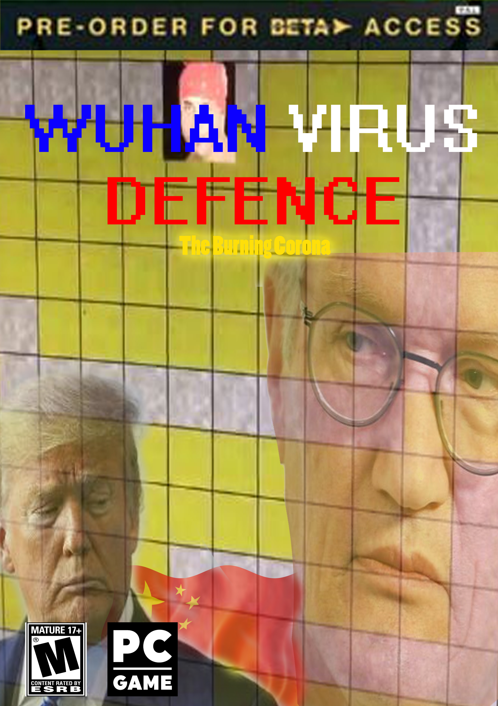

# Wuhan Tower Defence

## Description
Are you tired of the corona-virus? Well we are too! That's why we created this fun game about killing covid-19 :smile:

The game is a tower defence style game where you need to use both strategy and skill to kill all viruses thus ending the pandemic :hospital:

## How to run game
Go to the folder "rasmus-3" and write "make". After the compilation is done write "./play".

## How to run tests
Go to the folder "rasmus-3/build". To test GameObjects write "make test_GameObjects". To test GameStateMachine write "make test_GameStateMachine".